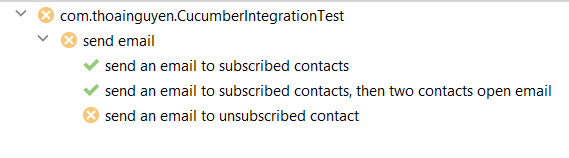

# Introduction

BDD test stands for behavior-driven development test. It is a testing methodology used in agile software development and is an extension of Test-Driven Development (TDD). 
This project demonstrates how to apply BDD in a simple Spring Boot application with Cucumber which is a tool that supports BDD with Gherkin language.

This Sping Boot application - Email Service contains some REST APIs to perform some operations in a CRM system such as:
- Send email to contacts (or customer)
- Track email opens
- Get email send statistics (how many contacts were sent email successfully to, how many contacts opened email)


## Tech stack

Docker Compose, MySQL, JDK 11, Gradle, Spring boot, Flyway, Cucumber

## Project structure
    .
    ├── docker                    
    ├──── init                    # contain initial SQL script to create databases in MySQL container
    ├──── docker-compose.yml      # build up MySQL containers and initiate needed databases
    ├── src                       
    ├──── main                    
    ├────── java                  # contain all source code
    ├────── resources             
    └──────── db.migration        # flyway scripts to initiate MySQL tables
    ├──── test                    
    ├────── java                  # cucumber configuration and steps definition
    ├────── resources             # cucumber feature files

## How to get started?
You can start Cucumber test of the application via the below command, we build up a
MySQL docker container before testing and remove it after testing automatically:
```shell
gradle build
gradlew clean test
```
The test result will include one test fail as the below screenshot in order to demonstrate how BDD
is applied to software development process, this failure test is a new requirement from
the business side. We can add more code to cover it by uncommenting line 53 at **EmailServiceImpl.java**


